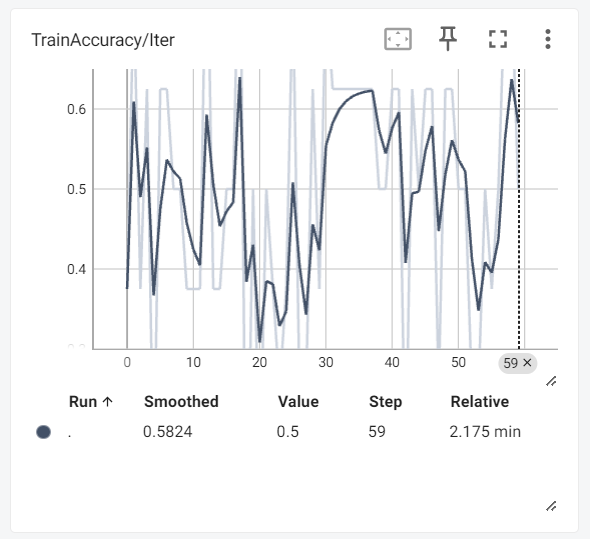

# Assignment 4 Question 1
## Team Student Ensemble

## Part 1: Dataset Collection

<u>Dataset 1: Apple vs Jackfruit Dataset</u>

- Dataset Credits:
    - Fruits Detection > Fruits-Apple-v1
        - https://universe.roboflow.com/ron-xmba6/fruits-detection-hrhn3
    - Jackfruit > 2023-04-10 11:58am
        - https://universe.roboflow.com/vietnam-fruit-in-lab/jackfruit-maj1o

 Dataset can be accessed here: https://iitgnacin-my.sharepoint.com/:u:/g/personal/22110103_iitgn_ac_in/ETOx7WAgqltAuhVpPSBEMaYB3ckKLDtF4t0s5Bxd3CLX5A?e=teupL5

 <u>Dataset 2: African Elephant vs Kangaroo Dataset</u>

- Dataset Credits:
    - kengeru > 2023-05-11 10:52pm
        - https://universe.roboflow.com/eliraz/kengeru
    - elephant > 2024-04-14 12:36pm
        - https://universe.roboflow.com/wild-animal-detection-hyeyj/elephant-goq1m

Dataset can be accessed here: https://iitgnacin-my.sharepoint.com/:u:/g/personal/22110103_iitgn_ac_in/EXKmnNNBwlxKgDbtV6-mYGEBBTA9NR2R_jN4sNZwFmo0wQ?e=B6QZcI

## Part 2: Training the Models of Different Architectures and Analysing

| Model                | Training Time(s)/epoch | Total Training Time(s) | Training Loss per Epoch                     | Training Accuracy per Epoch | Testing Accuracy | # Model Parameters | Model Size in MB |
| :--------------------| :--------------------: | :--------------------: | :----------------------------------------------------: | :-------------------------: | :--------------: | :----------------: | :--------------: |
| VGG 1                |   1-2                  | 8.03                   | [11.97, 0.26, 5.1e-04, 2.1e-05, 1.3792e-05] | [0.76, 0.96, 1.0, 1.0, 1.0] | 1.0              | 102762497          | 392.01           |
| VGG 3                |   2                    | 14.66                  | [1.07, 0.025, 0.008, 0.037, 0.063]           | [0.82, 0.993, 0.003, 0.987, 0.993] | 1.0              | 26061185          | 99.42      |
| VGG 3 AUG            |   3-4                  | 18                     | [1.07, 0.025, 0.008, 0.037, 0.063]           | [0.82, 0.993, 0.003, 0.987, 0.993] | 0.9750              | 26061185          | 99.42   |
| VGG 16                |   4/13                    | 40                 | [1.11, 0.7, 0.7, 0.7, 0.7]           | [0.5, 0.5, 0.5, 0.5, 0.5] | 0.5              | 134264641          | 512.18      |
| VGG 16 PRE            |   3                    | 13                    | [7.00, 0.20, 0.04, 0.002, 2.78e-07]           | [0.75, 0.956, 0.975, 1.0, 1.0] | 1.0              | 119549953          | 456.05      |

For Corresponding Code, See IPYNB file

## Part 3: TensorBoard

1. VGG 1

Training Loss / Iter
 

  
--

Training Accuracy / Iter
 

  
--

Testing Accuracy / Iter
 

  
--

2. VGG 3

Training Loss / Iter
 

  
--

Training Accuracy / Iter
 

  
--

Testing Accuracy / Iter
 

  
--

3. VGG 3 AUG

Training Loss / Iter
 

  
--

Training Accuracy / Iter
 

  
--

Testing Accuracy / Iter
 

  
--

4. VGG 16

Training Loss / Iter
 

  
--

Training Accuracy / Iter
 

  
--

Testing Accuracy / Iter
 

  
--

5. VGG 16 PRE

Training Loss / Iter
 

  
--

Training Accuracy / Iter
 

  
--

Testing Accuracy / Iter
 

  
--

## Part 4: Test Set Predictions

The Prediction Results are as follows:

VGG1 

  
--

VGG3 

  
--

VGG3AUG 

  
--

VGG16 

  
--

VGG16PRE 

  
--

### Part 5: Questions

- Are the results as expected? Why or why not?
   - Training Time: The results are as expected because I expect the larger models to take more time to train with the exception of VGG 16 with pretrained Conv Layers, which takes lesser time.
   - The number of model parameters and the model size also follow the expected trend because more the hidden neurons, more the number of weights.
   - The results in accuracy and loss are not as expected due to the model getting stuck in some local minima. In general, I expected more layers -> more accuracy. 
- Does data augmentation help? Why or why not?
    - Data augmentation increases the training time.
    - Size of the model remain same.
    - Leads to slight decrease in accuracy.
    - In large datasets, it may be helpful to prevent overfitting, and accurate predictions on real life data. 
- Does it matter how many epochs you fine tune the model? Why or why not?
    - Yes, it matters.
    - In "earlier" epochs, we see the testing and training accuracies increase while loss decreases.
    - After some time, the training loss decreases while the testing loss strats increasing.
    - This is when we can observe the model to begin overfitting.
    - A good number of epochs is thus required.
- Are there any particular images that the model is confused about? Why or why not?
   - In our dataset of Jackfurits and Apples, we cannot see such images generally because the classes look very different and there are scarcely any points that can be confused.
   - However, one such image exists:

   -  

### Part 6: MLP

| Model                | Training Time(s)/epoch | Total Training Time(s) | Training Loss per Epoch                     | Training Accuracy per Epoch | Testing Accuracy | # Model Parameters | Model Size in MB |
| :--------------------| :--------------------: | :--------------------: | :-----------------------------------------: | :----------------------------: | :--------------: | :----------------: | :--------------: |
| 1 Hidden Layer       |   1-4                  | 10.37                  | [70.81, 24.26, 10.98, 8.40, 21.04]          | [0.71, 0.85, 0.91, 0.94, 0.86] | 0.8              | 135477001          | 516.80           |
| 3 Hidden Layers      |   1-3                  | 9.49                   | [177.26, 0.75, 1.42, 0.76, 0.69]           | [0.60, 0.55, 0.66, 0.5, 0.5] |        0.50       |      134262607     | 512.17  |
| 6 Hidden Layers      |   1-4                  | 10.11                  | [31.46, 0.69, 0.7, 0.69, 0.69]           | [0.5, 0.5, 0.5, 0.5, 0.5] |         0.5      |      134276901     | 512.23 |

